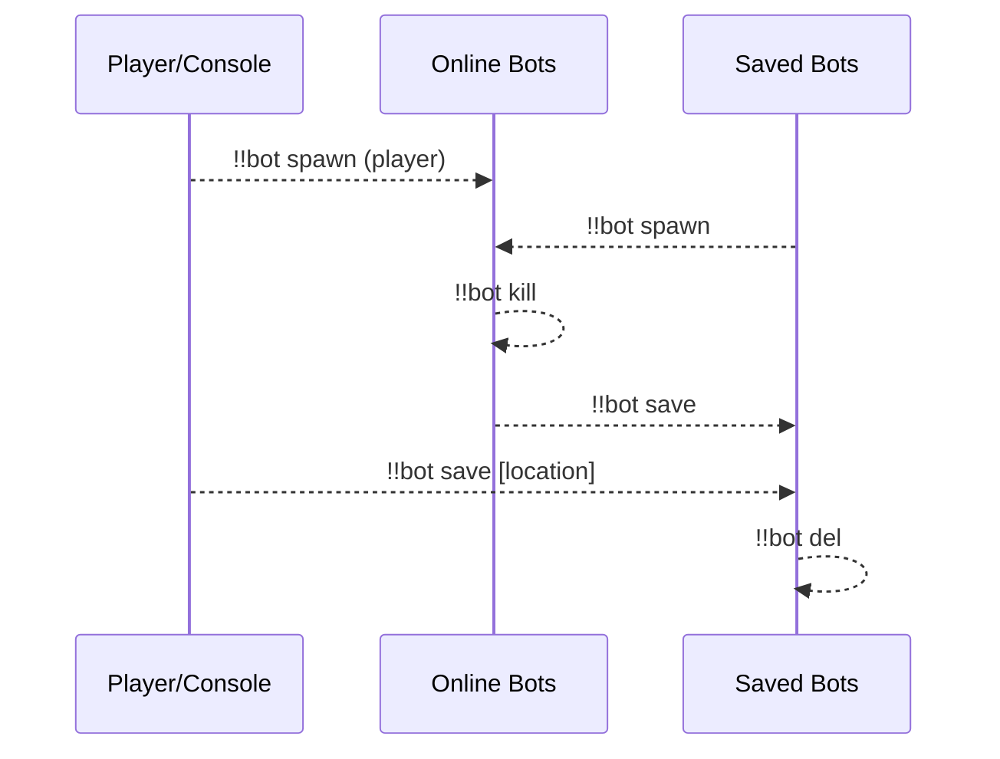
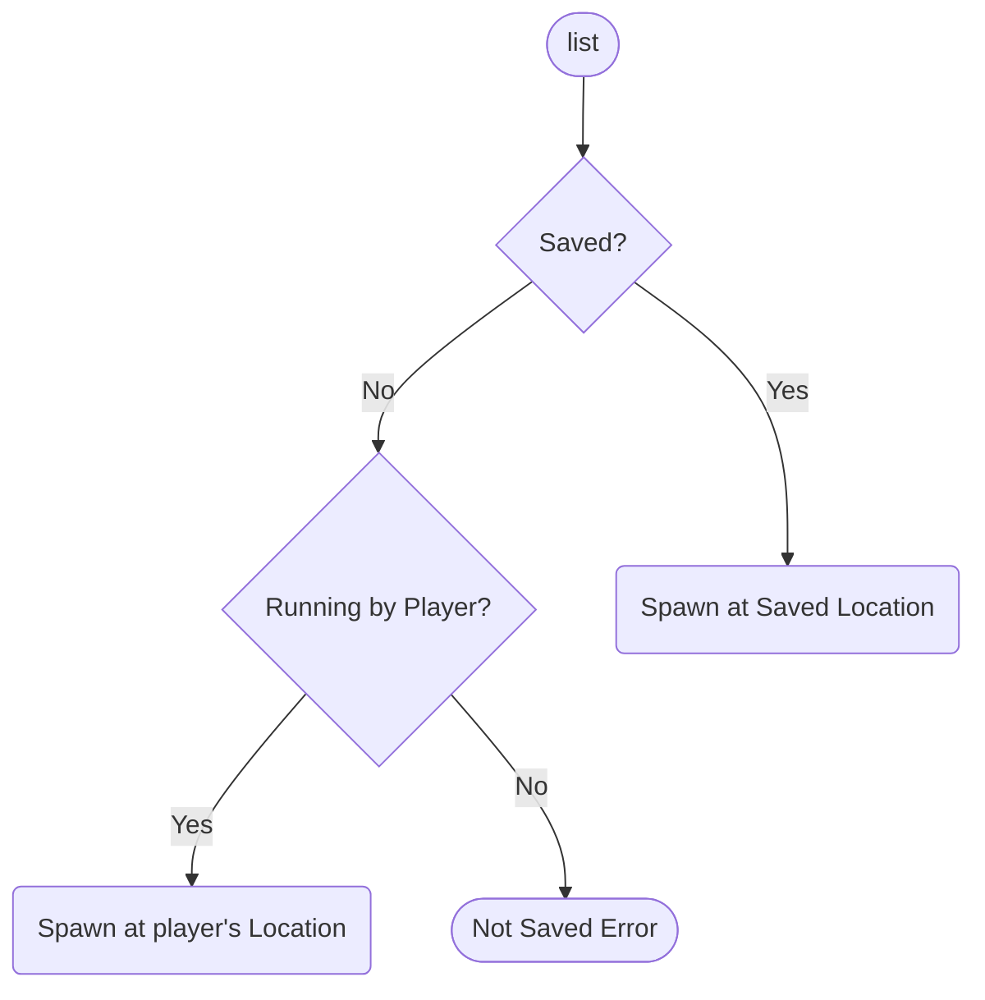
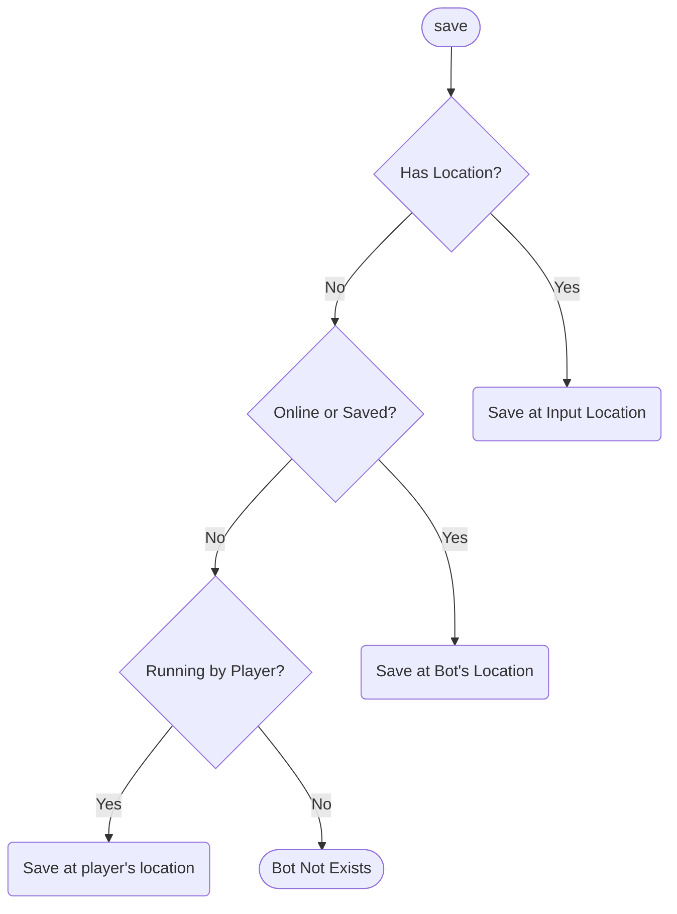
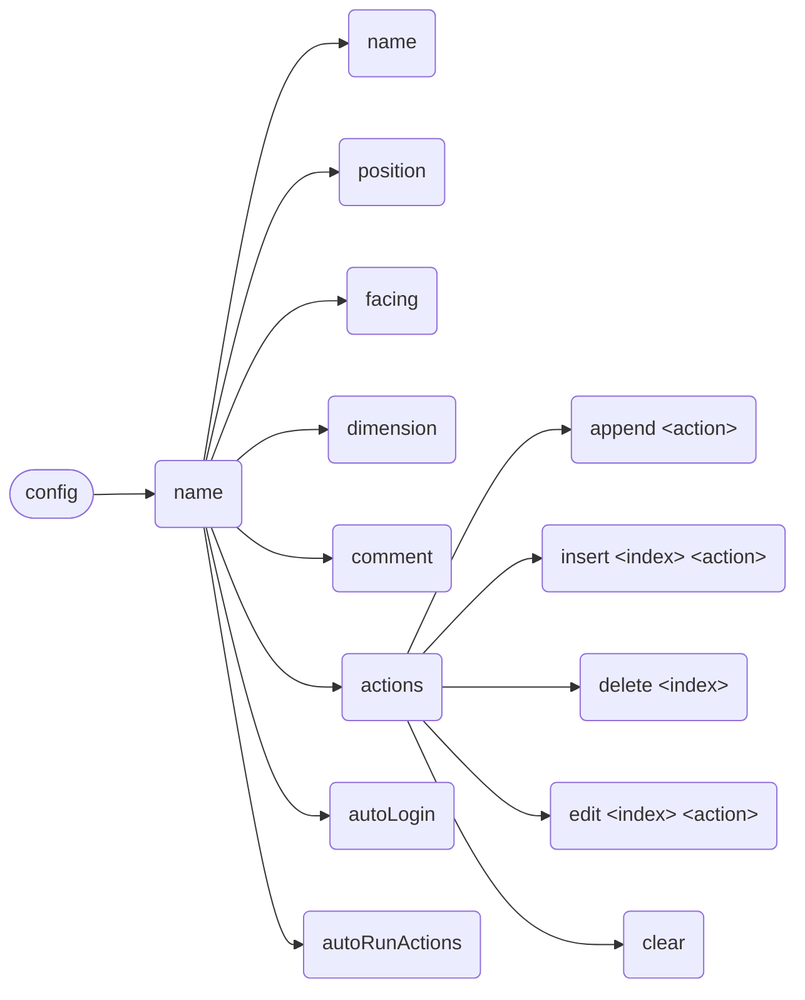

# Bot

[简体中文](https://github.com/AnzhiZhang/MCDReforgedPlugins/blob/master/bot/readme_cn.md)

> The best carpet bot manager!

## Dependencies

- [MinecraftDataAPI](https://github.com/MCDReforged/MinecraftDataAPI)
- [MoreCommandNodes](https://github.com/AnzhiZhang/MCDReforgedPlugins/tree/master/more_command_nodes)

## Usage

`!!bot` View help

`!!bot list [index] [filter]` Show bot list

`!!bot spawn <name>` Spawn bot

`!!bot kill <name>` Kill bot

`!!bot action <name> [index]` Execute bot action(s)

`!!bot info <name>` View bot info

`!!bot save <name> [position] [facing] [dimension]` Save bot

`!!bot del <name>` Delete saved bot

`!!bot config <name> <option> <value>` Config bot

### list

**index**: Page number of the list

**filter**: Available options are: `--all`, `--online` or `--saved`, filter bots

### spawn

Spawn bot

### kill

Kill bot

### action

Execute bot action(s)

When `index` is specified, execute specific action(s) instead of all actions

### info

View bot info

### save

Save bot

### del

Delete saved bot

### config

Config bot

## Config

### gamemode

Default: `survival`

Game mode of bot

### name_prefix

Default: None

Prefix of bot name

### name_suffix

Default: None

Suffix of bot name

### permissions

Minimum permission to use corresponding command

## FastAPI MCDR

This plugin supports [FastAPI MCDR](https://github.com/AnzhiZhang/MCDReforgedPlugins/tree/master/fastapi_mcdr) plugin, please refer to the source code for detailed API, or run and view the FastAPI document via `http://127.0.0.1:8080/docs`.
