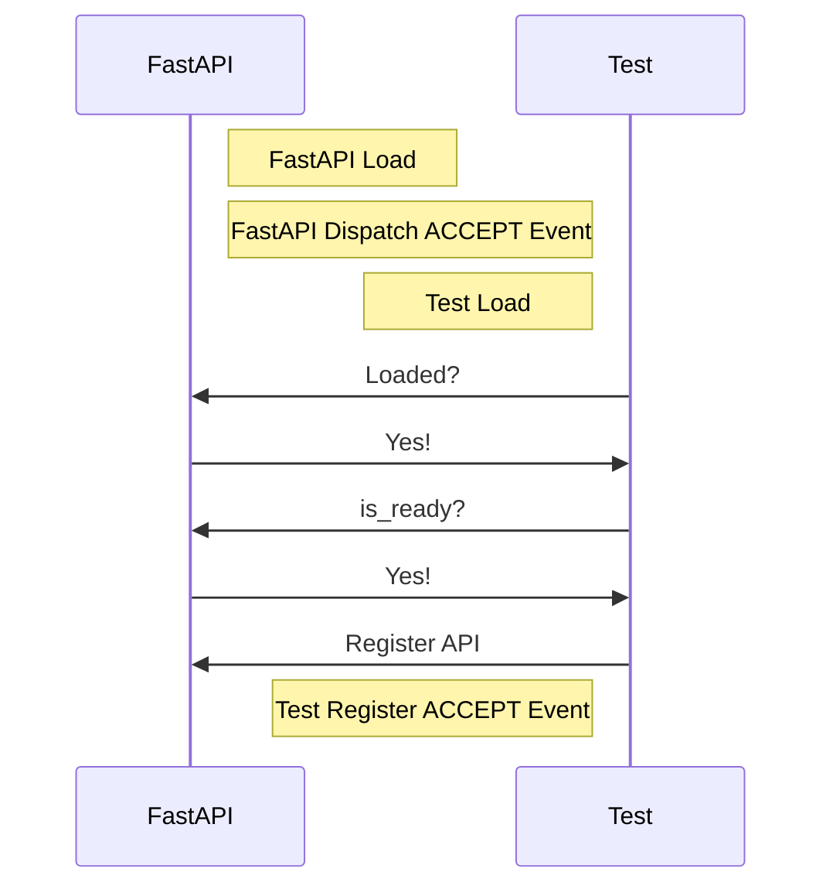
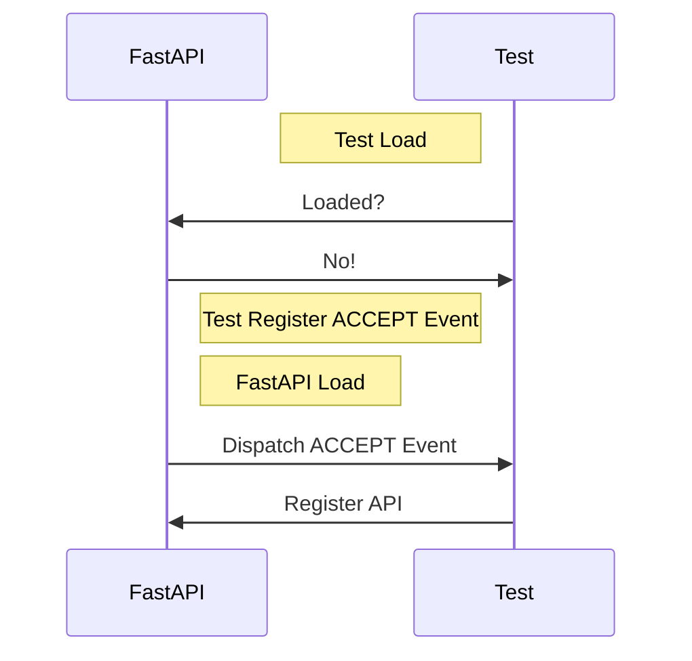
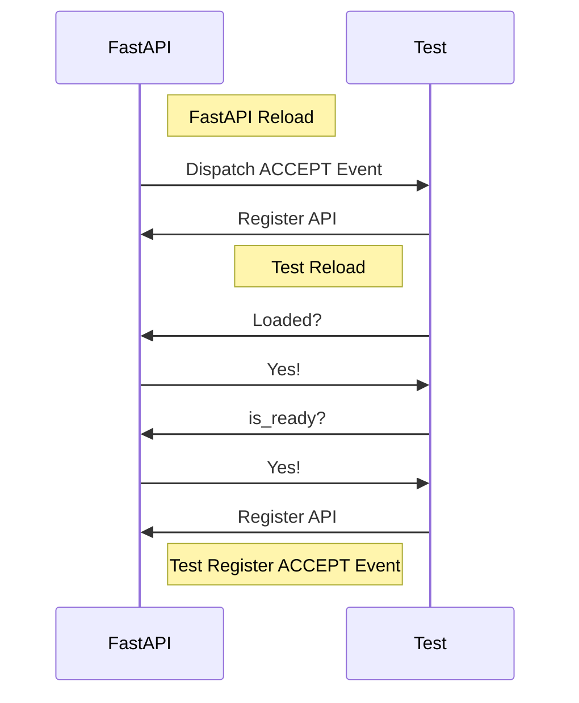

# FastAPI

[简体中文](readme_cn.md)

> Provides HTTP API

## Quick Start

In general, there are two things you need to do in your plugin:

1. Check FastAPI's status when loading. If it's ready for registration, directly register the API.
2. Register a listener for the ACCEPT event to register the API when it becomes acceptable.

Specifically, you need to add the following code:

```python
def on_load(server, prev_module):
    # register if fastapi_mcdr is ready
    fastapi_mcdr = server.get_plugin_instance('fastapi_mcdr')
    if fastapi_mcdr is not None and fastapi_mcdr.is_ready():
        register_apis(server)

    # register event listener
    server.register_event_listener(
        "fastapi_mcdr.accept",
        register_apis
    )

def register_apis(server):
    # save plugin id and fastapi_mcdr instance
    id_ = server.get_self_metadata().id
    fastapi_mcdr = server.get_plugin_instance('fastapi_mcdr')

    # register api
    fastapi_mcdr.add_api_route(
        id_,
        path="/test",
        endpoint=test,
        response_model=Dict[str, str],
        methods=["GET"],
    )

async def test():
    return "Hello, world!"
```

Visit <http://localhost:8080/docs> to view the API documentation.

## Technical Details

### Loading

In theory, providing an HTTP API externally should be a soft dependency. That's why checking FastAPI's status and registering an ACCEPT event listener are necessary. The following diagram illustrates the process of loading FastAPI and custom plugins:

Load FastAPI first, then load custom plugins:



Load custom plugins first, then load FastAPI:



With this design, you can achieve soft plugin dependency without worrying about the order of plugin loading. The following diagram shows the scenario of any plugin being reloaded:



## Standards

### ACCEPT Event

Event name: `fastapi_mcdr.accept`

An instance of `PluginEvent` for this event is also exposed as `ACCEPT_EVENT`.

### Public Functions

#### is_ready

The plugin's status for accepting registration. If forcefully registered, it will raise a `RuntimeError`.

#### add_api_route

Accepts parameters almost identical to the `add_api_route` function of the fastapi library. However, the first parameter `plugin_id` should be the plugin id, so that the plugin id is used as a prefix when registering the path.

In other words, if the id parameter is `test` and the path parameter is `/test`, then the registered path is `/test/test`.
