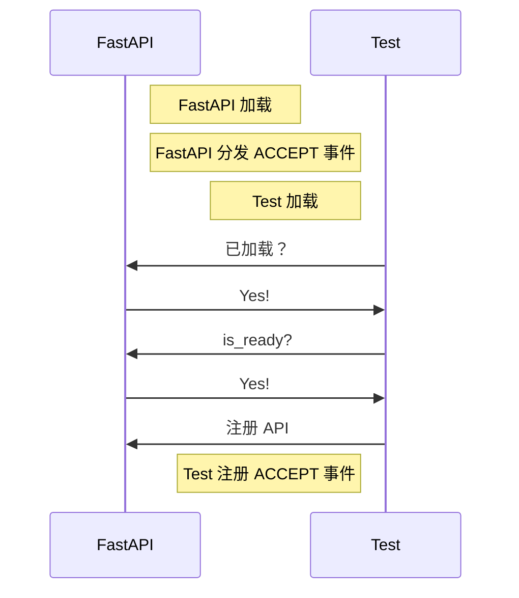
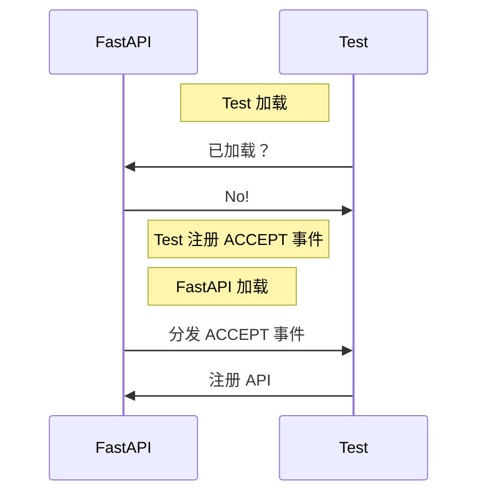
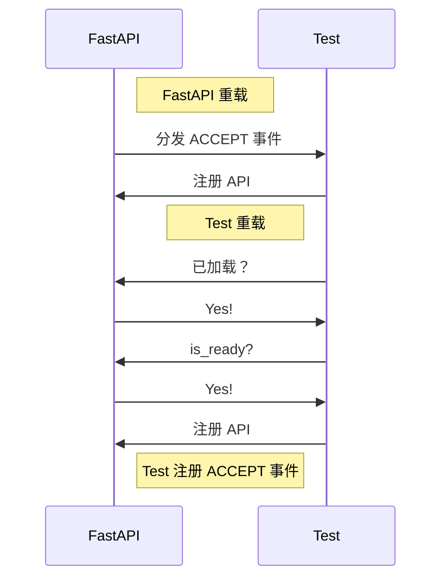

# FastAPI

[English](https://github.com/AnzhiZhang/MCDReforgedPlugins/blob/master/fastapi_mcdr/readme.md)

> 提供 HTTP API

## 快速开始

总地来说，您需要在您的插件中做两件事：

1. 加载时检查 FastAPI 状态，如已可以接受注册，则直接注册 API。
1. 直接注册 ACCEPT 事件的监听器，以便可以注册时注册 API。

具体地说，您需要添加以下代码：

```python
def on_load(server, prev_module):
    # register if fastapi_mcdr is ready
    fastapi_mcdr = server.get_plugin_instance('fastapi_mcdr')
    if fastapi_mcdr is not None and fastapi_mcdr.is_ready():
        register_apis(server)

    # register event listener
    server.register_event_listener(
        "fastapi_mcdr.accept",
        register_apis
    )

def register_apis(server):
    # save plugin id and fastapi_mcdr instance
    id_ = server.get_self_metadata().id
    fastapi_mcdr = server.get_plugin_instance('fastapi_mcdr')

    # register api
    fastapi_mcdr.add_api_route(
        id_,
        path="/test",
        endpoint=test,
        response_model=Dict[str, str],
        methods=["GET"],
    )

async def test():
    return "Hello, world!"
```

访问 <http://localhost:8080/docs> 即可查看 API 文档。

## 技术细节

### 加载

理论上来说，对外提供 HTTP API 应当是一种软依赖，这便是需要检查 FastAPI 状态并同时注册 ACCEPT 事件监听器的原因。下图展示了 FastAPI 插件和自定义插件先后加载的流程图：

先加载 FastAPI，再加载自定义插件：



先加载自定义插件，再加载 FastAPI：



通过这个设计，即可实现插件的软依赖，且无需考虑插件加载顺序的问题。下图展示了任意插件重载的情况：



## 标准

### ACCEPT 事件

事件名：`fastapi_mcdr.accept`

该事件的 `PluginEvent` 实例也会以 `ACCEPT_EVENT` 名公开。

### 公开函数

#### is_ready

插件可以接受注册的状态，如强行注册则会抛出一个 `RuntimeError`。

#### add_api_route

接受的参数几乎与 fastapi 库的 `add_api_route` 函数相同，但是第一个参数 `plugin_id` 应当传入插件的 id，以便注册路径时以插件 id 为前缀。

也就是说，如果 id 参数为 `test`，path 参数为 `/test`，则注册的路径为 `/test/test`。
