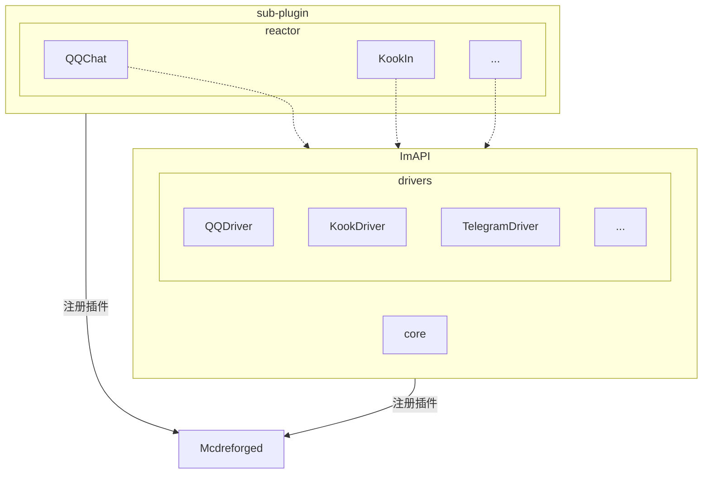
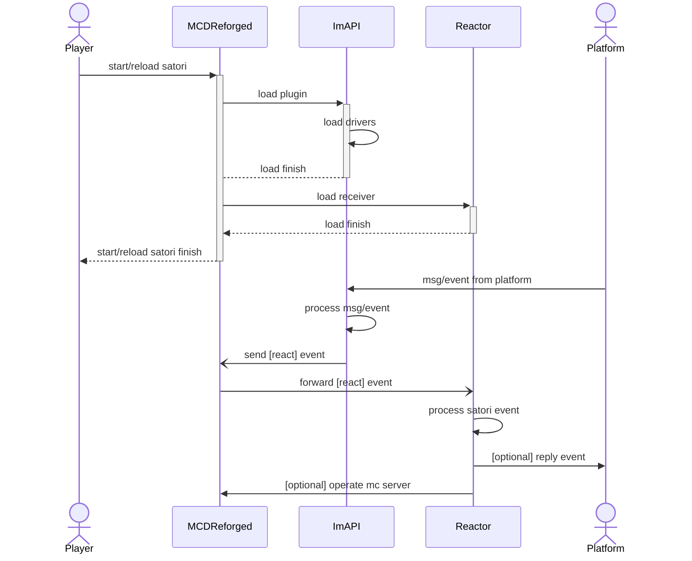
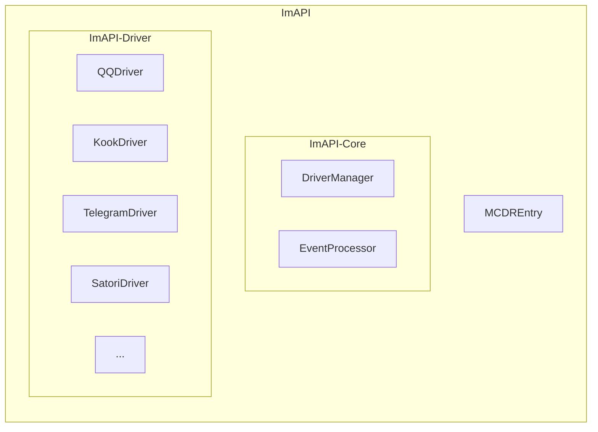

> [!NOTE]
> 既然已经计划不只支持qq平台，那该issue是否可以转为考虑做一个全新的插件: ImAPI

# ImAPI架构

## 概要说明

以ImAPI作为核心插件的架构，主要有如下几个角色

1. **外部系统**: 与MCDR互通且ImAPI支持的其他im平台，例如QQ，Kook，Discord，Telegram等
2. **ImAPI**: 事件处理的核心插件，负责将所有来自各个平台的消息与事件做统一处理，并封装成统一格式的事件(Event)进行广播
3. **Reactor**: 可扩展的、与平台协议解耦的应用层，基于ImAPI的事件进行响应与处理。在MCDR的插件关系上，Reactor插件依赖ImAPI

## 插件树

## 注册与加载流程

### 概述

1. SatoriAPI加载时，根据配置文件启动对应的receiver
2. Reactor加载时，向MCDR发送register事件，ImAPI会监听这个事件，将对应插件添加到注册表

### 加载流程图

## 主要事件
考虑借鉴[Satori协议](https://satori.js.org)的通信方式进行事件通信

## Third-Party Components

This plugin uses the following third-party open-source components:

- [satori-python](https://github.com/RF-Tar-Railt/satori-python) - Licensed under the MIT License.